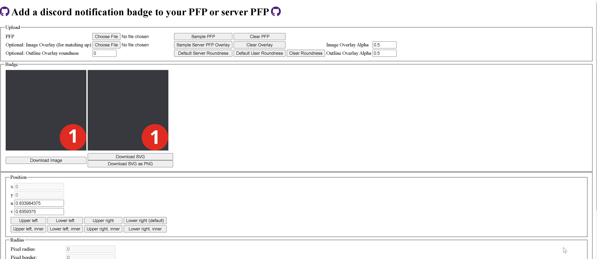

# Badger Badger

Website to add a badge to a discord server or user pfps.

Visit https://realazthat.github.io/badger-badger/ to try it out.



## Running Locally

```bash

npm install
npm run start
# Navigate to http://localhost:1234/badger-badger/. Note the trailing slash!


npm run build
npm run serve
# Navigate to http://localhost:3000/badger-badger/. Note the trailing slash!
```
